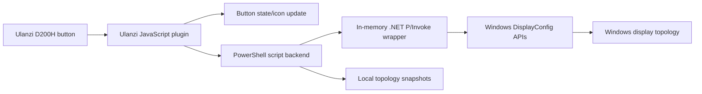

# Ulanzi Monitor Toggle Plugin Plan

## Goal

Create a Ulanzi D200H plugin that lets a Windows 11 user toggle one monitor, or a configured group of monitors, on and off from the Windows desktop. "Off" means the display is disabled from the Windows display topology, not physically powered down through DDC/CI.

The button should provide visible state feedback on the Ulanzi dock:

- On/active: the configured monitor or group is active in Windows.
- Off/inactive: the configured monitor or group has been removed from the active Windows desktop topology.

## User Requirements Captured

- Device: Ulanzi D200H.
- OS: Windows 11.
- Display behavior: disable monitors from Windows, not just put panels to sleep.
- Controls:
  - One button per monitor.
  - One button per monitor group.
  - Toggle behavior rather than one-way commands.
  - Visual on/off state on the Ulanzi dock.
- Hardware: mixed HDMI, DisplayPort, USB-C, or docked connections may be present.
- Restore behavior: preserve original settings as much as possible, including layout, resolution, refresh rate, rotation, and primary-display relationship.
- Marketplace concern: avoid bundling a native `.exe` helper if possible.

## Current Direction

Use a text-only Ulanzi JavaScript plugin with a PowerShell/.NET backend.

The plugin does not bundle a native executable. Instead, the Node.js service invokes a bundled PowerShell script. The script uses `.NET Add-Type` to compile a small in-memory C# wrapper around documented Windows display APIs:

- `QueryDisplayConfig`
- `SetDisplayConfig`
- `DisplayConfigGetDeviceInfo`

This keeps the package source-visible and avoids shipping a separate binary. The runtime still calls documented Win32 APIs.

## Current Progress

Completed in the initial scaffold:

- Created Ulanzi package folder using the SDK naming convention: `com.ulanzi.monitortoggle.ulanziPlugin`.
- Added a manifest with Windows-only D200H keypad action support.
- Vendored Ulanzi SDK common HTML and Node helper libraries.
- Added plugin-local `ws` dependency metadata and installed it locally for verification.
- Added source-visible PowerShell backend with `list`, `snapshot`, `is-active`, `disable`, `restore`, and `toggle` command entry points.
- Added Node service integration that invokes the backend and updates state icons.
- Added property inspector shell for label, mode, target keys, and snapshot name.
- Verified non-destructive display enumeration through both PowerShell and Node.
- Verified snapshot creation.
- Verified the safety guard refuses to disable every active display.

Not yet completed:

- Real disable/restore test on a non-primary display.
- Ulanzi Studio local install test.
- D200H physical button test.
- Discovery UI in the property inspector.
- Marketplace packaging review.

## Architecture



## Package Shape

```text
ulanzi-monitor-toggle/
  README.md
  package.json
  docs/
    PLAN.md
    VERIFICATION.md
    THIRD_PARTY.md
  com.ulanzi.monitortoggle.ulanziPlugin/
    manifest.json
    package.json
    package-lock.json
    libs/
    plugin/
      app.js
      plugin-common-node/
    property-inspector/
      inspector.html
    scripts/
      WindowsDisplayControl.ps1
      WindowsDisplayWatcher.ps1
    resources/
      actions/
        toggle/
          on.svg
          off.svg
```

## Key Constraints

### Ulanzi SDK / Marketplace

- Public SDK docs describe JavaScript plugins and Node.js service code.
- Marketplace rules around bundled executables are unclear.
- Ulanzi support may not respond quickly, so the initial implementation avoids a bundled `.exe`.
- The plugin should remain Windows-only in the manifest.
- The plugin should avoid admin rights, drivers, services, startup items, and hidden installation steps.

### Windows Display Topology

- `SetDisplayConfig` can disable active display paths by applying a supplied display configuration that excludes selected targets.
- The plugin must refuse to disable the last active display.
- The plugin should snapshot topology before disabling any display.
- Restore should prefer the exact saved topology rather than guessing a new layout.
- Mixed connection types are acceptable, but docked or hotplugged displays may change adapter/target IDs. The UI should show both friendly names and stable keys where available.

### No Bundled Executable

- The backend is a PowerShell script with source-visible C# P/Invoke.
- `powershell.exe` must be available.
- Some enterprise machines may block PowerShell script execution or child process creation.
- The Node plugin uses `child_process.spawn`, which must be supported by Ulanzi's Node runtime.

### Safety

- Never disable all active monitors.
- Save a snapshot before applying a disabling operation.
- Provide a restore command.
- Treat failed restore as a high-severity error and surface it through the plugin.
- Keep display operations explicit and target-key based.

## Command Protocol

The PowerShell backend exposes JSON commands:

| Command | Purpose | Verification |
| --- | --- | --- |
| `list` | List active monitors and stable target keys. | Run locally; output valid JSON with display names and keys. |
| `snapshot` | Save current active topology to a local binary snapshot. | Snapshot file exists and command returns success JSON. |
| `is-active` | Check whether all configured targets are active. | Compare JSON result to Windows display settings. |
| `disable` | Disable selected targets after saving a snapshot. | Target display disappears from active topology; remaining displays stay active. |
| `restore` | Restore a saved topology snapshot. | Original layout returns. |
| `toggle` | Disable if active, restore if inactive. | Repeated calls alternate state. |

## Verification Strategy

### Phase 1: Non-Destructive

- Verify `WindowsDisplayControl.ps1 -Action list` returns valid JSON.
- Verify monitor keys include adapter LUID, target ID, source name, friendly monitor name, and position.
- Verify the Node wrapper can invoke the backend and parse JSON.
- Verify Ulanzi manifest is valid JSON.

### Phase 2: Snapshot Only

- Run snapshot command without changing topology.
- Confirm snapshot file is created in local app data.
- Confirm command output includes file path and active display count.

### Phase 3: Controlled Disable/Restore

- Test only on a non-primary monitor first.
- Confirm the helper refuses to disable the last active monitor.
- Disable one target.
- Confirm Windows Settings no longer shows that monitor as active.
- Restore from snapshot.
- Confirm layout, resolution, refresh rate, and primary monitor are restored.

### Phase 4: Ulanzi Runtime

- Install plugin locally into Ulanzi Studio.
- Confirm D200H shows the action and button icon.
- Configure one monitor key in the property inspector.
- Press button:
  - It disables the target display.
  - It changes icon/state to off.
- Press button again:
  - It restores the display.
  - It changes icon/state to on.

### Phase 5: Group Toggles

- Configure multiple target keys.
- Disable group.
- Confirm remaining active monitors are stable.
- Restore group.
- Confirm original topology returns.

### Phase 6: Marketplace Hardening

- Remove development stubs and logs.
- Add source documentation for the PowerShell backend.
- Add code-signing only if a native fallback is introduced later.
- Package without native executables.
- Test on a clean Windows 11 account.

## Task Breakdown

### 1. Project Scaffold

- Create plugin folder structure.
- Add `manifest.json` with Windows-only support and D200H keypad action.
- Add on/off state icons.
- Add property inspector shell.
- Add Node service entry point.
- Add README and plan.

Verifiable outcome:

- `manifest.json` parses as valid JSON.
- `package.json` parses as valid JSON.
- Project structure matches the documented package shape.

### 2. Backend: Display Enumeration

- Implement PowerShell `.NET Add-Type` wrapper.
- Implement `list`.
- Return JSON with:
  - target key
  - friendly monitor name
  - source display name
  - output technology
  - active state
  - position and size

Verifiable outcome:

- `powershell.exe -NoProfile -ExecutionPolicy Bypass -File .\scripts\WindowsDisplayControl.ps1 -Action list` returns valid JSON.

### 3. Backend: Snapshot / Restore

- Serialize active DisplayConfig paths and modes to a binary snapshot.
- Restore from snapshot through `SetDisplayConfig`.
- Preserve topology exactly where Windows accepts the saved config.

Verifiable outcome:

- Snapshot file is created.
- Restore command succeeds without changing topology when restoring the current topology.

### 4. Backend: Disable / Toggle

- Implement target filtering.
- Refuse to disable all active displays.
- Save snapshot before disabling.
- Implement `toggle` as:
  - if all targets active, snapshot and disable
  - otherwise restore saved snapshot

Verifiable outcome:

- Disabling one non-primary monitor works.
- Restore re-enables it.
- Disabling all active monitors is refused.

### 5. Node Service Integration

- Spawn PowerShell backend.
- Parse backend JSON.
- Store per-action snapshot paths.
- Update Ulanzi state icon after each command.
- Surface errors through Ulanzi alert/log mechanisms.

Verifiable outcome:

- Local Node test can run backend `list`.
- Ulanzi button press toggles the selected monitor.

### 6. Property Inspector

- Let users configure:
  - action label
  - target keys
  - snapshot name
  - single/group mode
- Future: add a refresh/discovery UI to list available monitors.

Verifiable outcome:

- Settings are saved and passed to the Node service.

### 7. Packaging

- Fetch/copy Ulanzi SDK common HTML and Node helper libraries.
- Package folder in Ulanzi's expected layout.
- Install locally in Ulanzi Studio.

Verifiable outcome:

- Plugin appears in Ulanzi Studio.
- D200H can add the action.

## Known Risks

- Ulanzi marketplace may still object to PowerShell process spawning.
- Enterprise policies may block PowerShell or `ExecutionPolicy Bypass`.
- Monitor adapter/target keys may change across docks, GPU driver updates, or hotplug events.
- Multiple independent group toggles can interact in surprising ways if each restores a different saved snapshot. The first version should document this and later add a central state coordinator.
- Exact restore may fail if a monitor is unplugged or unavailable.

## Initial Implementation Scope

The first working slice should include:

- Full plan document.
- Plugin manifest.
- Node service scaffold.
- Property inspector scaffold.
- Source-visible PowerShell backend.
- Verified non-destructive `list` command.

Destructive commands (`disable`, `toggle`) should exist but only be tested deliberately after confirming monitor keys and safety behavior.
